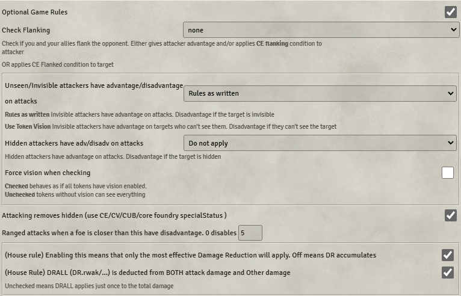

**Work in progress - not complete or checked**
[TOC]

## What is this document?
This guide is intended for new users to midi-qol who need some guidance on setting the very many options that exist.
## What can midi-qol do?
Quite a lot, depending on how you configure it; at its simplest, it can speed up rolling by reducing the number of clicks/popups. To help illustrate some of its capabilities, here's an example: a spider attacking a goblin using the base dnd5e system.  
  
Foundry has displayed a chat card with buttons on it for attack and damage and doing the saving throw, as well as a "versatile" damage roll for the damage to be done on a failed save. You go through the following steps
  * Press the attack button which prompts you to decide if the attack is made with advantage or disadvantage and whether there are any special bonuses, like luck/bardic inspiration.
  * Decide if the attack hit remembering to deal with any reactions the target might take, like a shield spell.
  * If the attack hit roll hit roll the damage remembering to check if it is a critical hit and if there are any special bonuses for the damage, like a mace of disruption/drgon slayer sword.
  * Apply the damage using the system damage tray
  * Roll the saving throw, remembering if the save is made with advantage/disadvantage and any bonuses to apply
  * Roll the versatile damage as well if a failed save, or if half damage will be taken even on a success
  * Apply the versatile damage using the system damage tray, remembering to use 0.5x if necessary
  * Manually apply any special effects that the attack mid have, e.g. the posisoned condition (not in this example).

Midi-qol exists to help you automate some or all of these steps. Before going through the detail of how to set this up here is the same attack done with midi-qol with full automation, all accomplished with a single cick of the item button.

| 

Here's what happened with that single click:
  * The attack roll was made
  * The attack was determined to have hit the goblin
  * Because of that, damage was rolled (both bite and poison, because midi knows that poison damage will be applied even on a success)
  * A constitution save was rolled for the goblin, and the goblin was found to have succeeded
  * Damage was applied to the goblin accordingly (full piercing damage, as the goblin has no resistances, and half poison damage, as the goblin succeeded the save)
  * A GM-only summary damage card was displayed, showing the GM precisely what damage was done, and giving them the option to reverse or revise it
  * If there _had_ been an effect that should be applied only on a failed save, it would automatically have done so

Importantly, while this was only a single click, it could be configured to be exactly as "automatic" as the table wants it to be. While it is possible to set up items with flags for advantage and disadvantage under certain circumstances, players may still want the normal attack popup, rather than "fast-forwarding" - this is configurable. Players may want to still click a button to roll their damage - this is configurable. Players likely _will_ object to their saves being automatically rolled for them - this is, of course, configurable! A GM may prefer the damage to _not_ be applied automatically, but rather simply calculated, leaving them the final option to click "apply damage" - this is configurable. With great configurability comes great a great number of settings; all that configuration will be addressed further below. First: Troubleshooting.
## I've installed it but it does not do anything....
Midi-qol is a fairly complex module with many configuration options and dependencies on other modules. To make it work you have to go through a setup process where you configure it to work the way you want.

If you are too impatient to read a getting started guide, here is the quickest way to get something working. 
  1. Install the prerequisite modules (socketlib, libwrapper and Dynamic Active Effects), midi-qol won't activate without them.
  2. Go to configure settings and for midi-qol tick "Enable Combat Automation".
  3. Navigate to the midi-qol settings and click on the workflow button.
  4. Go to the quick settings tab and click full automation and confirm the changes. Midi will now do most things out of the box when you target an opponent and roll the sword.

Once you've done that come back and read through the rest of the configuation guide.

1. Install the prerequisite modules plus any nice to haves you want.
2. Configure midi-qol to work the way you want.
3. Get some midi-compatible items to make all this automation stuff work.

## Prerequisites (modules you must install)
* Dynamic Active Effects
* libwrapper
* socketlib

## No longer required or supported.
* Advanced Macros
* ItemMacro

## Modules you really should install
* **Times-up.**
Required if you want effects to automatically be removed on expiry, either world time on combat turn/round. If you want time to advance in your world both **Simple Calendar** and **Small Time** are highly recommended.

## Modules that are nice to have
* **Convenient Effects** provides status effects (blinded, charmed, etc.) pre-configured with midi-qol flags, which can be applied to targets as a result of using an item. In addition, when using an item midi can automatically apply the Convenient Effects-defined effects for that spell. (Note that as of v12, Convenient Effects no longer alters the system's existing status effects or allows you to create new ones).

* **Monks Token Bar/Let Me Roll That for You**.
When automating saving throws both of these modules allow you to have players roll their own saving throws and midi-qol will interact with them to prompt for and record the saving throws (_Monk's Tokenbar is recommended as LMRTFY is not actively being developed anymore_).

* **Automated Animations** (and **D&D5e Animations**)
This adds some nice animations to item/spell usage and is configured to work with midi-qol. Highly recommended.

* **Dice So Nice**
If you like 3d dice rolled to the screen this is a must have. It is mostly compatible with midi-qol. Any oddities are the result of midi-qol.

* **Active Token Effects** 
This adds to the list of effects you can apply for things like vision lighting and so on.

* **Effect Macro**
Allows you run a macro when an effect is applied/created/toggled.

* **Active Auras**
This allows effects to be applied to nearby tokens without having to trigger any items. Think Paladin's Aura of Protection

* **Anonymous**
This module can help you hide the names of creatures that you don't want revealed to your players and is compatible with MidiQOL.

#### 
## Configuration
### Conguration overview
First enable combat automation in the midi-qol settings.
The next sections cover configuring how that combat automation works, midi refers to a attack or spell cast as a workflow. You need to click on the workflow settings to manage the next set of settings.
The steps are:
1. Configure Attack/Damage rolls
2. Configure the Workflow Tab
3. Look and feel
4. Configure Other optional settings
  * Reactions
  * Concentration (now uses the system's concentration with some added extras)
  * Optional rules
  * Mechanics.

Most setings are configured on the configuration application (the workflow button on configure settings) and is accessible only to a GM. Some settings available to all users are on the configuration settings application from the foundry sidebar.

#### Configure attack and damage rolls
Midi has several concepts that can be confusing to first time users.
##### Rolling Attacks and Damage.
Normally when you roll an item it displays a chat card with attack and damage buttons. There are Midi settings to alter that process. Both the GM and Player tabs let you configure how rolling an item behaves, which will be described in more detail below. Briefly: Auto-rolling attack/damage results in the attack being rolled immediately upon item use, and the damage being rolled either every time an attack is rolled, or only upon a hit. Fast-forwarding attack/damage results in skipping the configuration (advantage/normal/disadvantage or critical/normal) window for attack/damage rolls.

This works fine if you are doing an ordinary attack, but sometimes you want to do some hand editing of the roll and not do everything automatically. The rollToggle key allows you to do this (dfault T). If you hold T when clicking on the item icon the normal sense of fastForwarding and auto roll is reversed. So if you were doing automatic rolls pressing T will display the Chat card for the item with attack and damage buttons ready for you to click.

##### GM Tab
  
- Auto Roll Attack: GM attack rolls will be auto-rolled
- Skip Consume resource dialog: 
  - No Auto consume: Default behavior - no skipping of resource consumption dialog
  - Auto consume spell slot: Spell slots will automatically be used, with no prompting
  - Auto consume resources/uses: Resource-consuming or limited use items will automatically consume/use, with no prompting
  - Auto consume resources/spell slots: Both of the above
- Auto fast forward attack: GM attack rolls will skip configuration dialog
- Auto roll damage:
  - Never: Default behavior - damage must be manually rolled by pressing the damage button
  - Always: Damage will always be rolled if an item has a damage roll. It will _not_ be applied if it shouldn't be; just rolled
  - Saving Throw Only: "Other Formula" damage will be automatically rolled when normal damage is manually rolled
  - Damage Roll Needed: Damage will be rolled when it "should" be rolled (e.g. an enemy is hit by an attack)
- Auto fast forward damage: GM damage rolls will skip configuration dialog
- All damage/critical rolls are 'average' results: Often monster statblocks will say something like "7 (1d8 + 3) damage" - this option allows you to always take the "7" in such cases for NPCs only, PCs only, all rolls, or (default) none
- Remove chat card buttons after roll: Which (if any) buttons to remove from the chat card after their respective roll has already been done
- GM Roll details hiding: This one's fairly well documented in the settings menu itself
- Hide GM attack/damage/saving throw 3d dice rolls - overrides other settings (merge card only): If using Dice So Nice, hides visual rolls for the GM's rolling of these types of rolls
- For attack/damage rolls display with 'dice so nice ghost rolls' rather than hiding the roll (merge card only): If using Dice So Nice, still shows the roll but replaces the values on each die with `?`s so the rolled results are still secret
- Add fake dice to GM Dice So Nice rolls: If using Dice So Nice, add additional "decoy" dice to GM rolls so players aren't certain how many dice are being rolled
##### Player Tab

Similar to the GM tab but applies for non-gm players. The same settings apply to all players.  
#### Configuring the workflow.
Midi has the concept of a workflow, when you start the attack/cast the spell midi goes through a set of steps to determine the outcome of the roll, starting with targeting and finishing with applying status conditons (like poisoned).
The workflow tab alows you to configure how each of those steps are performed and if they are automated or not.
#### Configure targeting
Midi expects you to target who you want to hit before clicking the weapon/spell you want to attack with. This can be tedious for Area of Effect Spells (fire ball) or Ranged Spells (Mass Healing Word). Midi can automate targeting for those spells if you wish.  

As players have been known to forget to target when it is their turn and this results in having to target then roll again. Midi supports target confirmation, configurable per player, to present a dialog after you hit the roll item button. This assists in setting the targets correctly.

The following settings are not for target confirmation, but for targeting in general:

Template spells are spells like Fireball. If auto targeting for template spells midi will highlight the potential targets while the template preview is active, once placed midi will use the tokens inside the template as the targets for the spell.

Most of the other settings are self explanatory (or have explanations in as hints in the settings menu). The only one which is not so is "Auto target for ranged target spells/attacks" - this allows you to specify a Target of, for instance "15 Feet Enemy", which would then auto-target all opposite-disposition tokens within 15 feet.

Midi supports a few additional modules for determining how templates behave.

#### Configure active effects

Often, an item will have an active effect on it which should be applied to the target of the item's use (for instance, a "bless" effect for the bless spell). By default, such an effect can only be applied by the GM. With midi, these can be set to auto-apply. More details on _conditional_ application (e.g. a failed saving throw) later.

#### Automated Attack Roll
When an attack roll is made midi will work out what sources of advantage/disadvantage there are (midi flags - more on this later, nearby foes etc - various optional rules settings and any applicable bonus).

#### Configure hits

Roll a separate attack per target: When targeting multiple creatures with an attack-rolling item, roll a separate attack for each

#### Configure checking saves
Midi can automate the process of requesting and adjudicating saves.

Most of these are well documented within the settings menu itself. For those that could use some elaboration:

- Search item description: Typically, items that have a "half damage on save" have a consistent use of language for that. Midi will search for that, and if present automatically assume half damage on save. Specific behavior regarding save damage can be configured per-item on the midi-qol tab, as this is sure to not get _everything_, especially for homebrew items
- Prompt Players to Roll Saves: How players will be prompted when they need to roll saves
  - Auto roll and show roll dialog: When a save is required from a PC, the player will get the "Advantage/Normal/Disadvantage" roll dialog popped up on their screen immediately
  - Chat Message: When a save is required from a PC, they will be whispered the required save, and should then roll it themselves from their character sheet, at which point the workflow will continue
  - The remaining options integrate with various modules, and have behavior specific to each
  - Note that when testing, if no player is logged in and configured to be using an Actor as their main character, rolls against that actor will instead follow the "Prompt GM to Roll Saves (Linked)" setting. Speaking of which...
- Prompt GM to Roll Saves (Unlinked/Linked): Similar to above but for GM-controlled actors, and split between linked tokens and unlinked tokens

#### Configure damage

There are a good chunk of settings here. Most assume damage application via midi's "Auto apply damage to target" (even in the case of "No" they work best with "No + damage card" so that midi's damage application is still used).
- Enhanced Damage Roll Dialog: Allows selection between, for instance, normal vs versatile damage within the damage configuration. This, naturally, relies on damage rolls _not_ being fast-forwarded
- Auto apply damage to target: Many of these refer to a "damage card" - see the automated spider bite example; that blue card at the bottom is what's being referred to there, containing the "total" damage, as well as the "applied" damage (total less/plus resistance/vulnerability/modification), as well as apply/undo buttons. All of the dropdown options speak for themselves; the only standouts are the `+ misses` ones. These will display the damage application card even if an attack misses, which allows the GM to adjudicate themself and apply damage through midi on a miss if desired
- Show a player's damage card: These show a simpler "player-friendly" version of the damage card. The `+ buttons` options allow the players to apply/unapply damage
- Display the player damage card if the rolled damage does not match the applied damage for some target: Does as it describes. Note that this is an even simpler damage card, and having this option checked _overrides_ whatever you have selected for the previous setting; it will _only_ display this simpler damage card, and _only_ when damage rolled is not equal to damage applied. See the following image for an example, where the Giant Spider has resistance to bludgeoning damage:

- Apply Damage immunities: As described, as are the following 3 settings
- Damage Reduction Save Order: In the case of a "half on success" save damage, whether to first apply any damage modification (`system.traits.dm` type keys) to rolled savable damage, _then_ halve it, or halve it, then apply the damage modification. Example: 10 poison damage was rolled, the actor has `-5` damage modification to poison damage. On a failed save, they'd take `10-5=5` poison damage. On a successful save, they'd either take `(10-5)/2=2` poison damage, or `(10/2)-5=0` poison damage, depending on whether the setting is `Damage Reduction -> Saves` or `Saves -> Damage Reduction`, respectively
- Require 'Magical' property: As described
- Roll Other damage formula for rwak/mwak (and for spells): Midi will generally treat "Other Formula" as "Other Damage" in an item. When Other Formula is filled in, there appears a new "Other Formula will be rolled if true" activation condition in the midi-qol tab of an item. Here are how the options for these two settings work:
  - Off: Other Formula is never automatically rolled (default behavior)
  - Always Roll: Other Formula is _always_ rolled and treated as damage
  - Other Condition True: The aforementioned activation condition will be evaluated if it exists, and if true, Other Formula will be rolled and treated as damage
  - Condition True & Save present: As above, but if a Saving throw is not on the item, a blank activation condition will not evaluate to `true`. If using any of these options, there is little reason not to use this last one; Other Formula can always be forced to roll on a non-save item by putting `true` in its activation condition box

#### Configure Concentration

Midi-qol now expands on the system's implementation of concentration. Most of the options here are self-explanatory, but some for some detail:
- Force a concentration save when damage taken: Well documented. Certain attribute keys only visually work with "Roll Concentration Item" selected (for example, minimum concentration roll)
- Single Concentration Check: This prevents the issue of an attack with save-attached damage prompting two concentration rolls rather than one
- Remove concentration when effects removed: Generally speaking, if an actor is concentrating, there are "dependent" effects which, when concentration is removed, will themselves be removed. This option allows the reverse to happen; if there are dependent effects (or templates), and they're all removed, concentration will automatically end. Note that if there are _not_ dependent effects/templates, concentration can still exist - this only impacts concentration that _does_ have those dependents

#### Configure Reactions

Midi-qol supports "reaction processing" - keeping track of reactions and auto-prompting for their use. While most of that configuration will be on a per-item basis, there are some general settings as well:
- Check PLAYER reactions (and NPC/GM reactions): Whether to check to prompt player/GM reactions. On/Off behave as expected - On + Magic Items enabled integration with the "Magic Items" module to pull possible reactions from any Magic Items-created items
- Reaction check timeout: How long to wait for user input before closing the reaction prompt and moving on
- Show Chat prompt for reactions: Displays an auto-deleting message for the GM in chat when a reaction prompt is opened for a player; this lets the GM see who/what they're waiting for
- Show attack roll: For reactions which prompt on being hit, what attack roll info to show in the prompt
- Allow any reaction spell to be used: As described
- Enforce Reactions: 
  - Do not check: Reactions are not tracked in any way
  - Display status icon: Adds a "Reaction Used" status effect which is automatically applied when a reaction is used and removed on the start of an actor's turn. When the status effect is applied, reactions will no longer auto-prompt
  - Characters: prompt if used: As above, but if a PC tries to use an item that costs a Reaction, they'll receive a prompt telling them they've used their reaction already, and asking if they still want to use the item
  - All actors: prompt if used: As above, but for NPCs as well as PCs
- Enforce Bonus Actions: The same as above, but for Bonus Actions rather than Reactions
- Record Attacks of Opportunity: As described

#### The "Misc" Tab
There are a lot of extra options that midi's got. We'll now go through the rest, one section at a time. First, the Misc tab.

- Display Midi item fields in a separate tab: Creates the "Midi-qol" tab on item sheets
- Lowest User role for Item's properties: Limits who can access said tab based on user role
- Add actor/item on use macro to sheet: Enables one of midi's most important high-automation features; the ability to have macros run at specified stages of a workflow, either attached to a specific item or a specific actor

- Show Item details in chat card: Allows you to hide item details from showing up in chat cards. The "Show Details" button lets you further specify which items will have their details shown. If in doubt, enable everything; better to show too much than too little
- Merge Rolls to one card: As described. Many midi flags assume this to be true to be visually accurate
- Condense Attack/Damage Rolls: As described
- Add extra buttons to merge card: If _not_ auto-rolling attack/damage, allows fast-forwarding through the roll confirmation dialogs in the case of advantage/disadvantage or critical/normal without having to hold a keybind
- Collapsible Targets: As described
- Display Confirm Roll Button: Allows the GM (or also Players) to "confirm" a hit-miss prior to the workflow finishing. Note that this doesn't always play nice with the rest of midi's features
- Autocomplete workflow if required: From time to time, you may see a popup telling you that a previous workflow is incomplete. This generally means that for whatever reason, you're attempting to use an item before its previous use "completed." With this option enabled, the previous use will be auto-completed
- Color code Hit/Miss/Save Display: By unchecking, allows you to disable the green/red highlighting of hits/saves and misses/fails
- Only highlight critical/fumble hits: Only natural 20s/natural 1s on attacks rolls will be highlighted green/red
- Move roll formula to tooltip: As described. Advantage attribution is a handy midi tool which will display _why_ an attack has advantage/disadvantage when the attack is clicked open
- Show Fast Forward: If fast forwarding (but not auto-rolling) attack/damage, will put a reminder of that on the attack/damage buttons

- Chat cards use token name: Both this and the following setting affect only the _target_ portion of chat cards. Enabling this setting results in the token name being shown as the target
- Use Actor portrait in chat cards: As above - enabling this setting results in the actor portrait being used, rather than the token art, for the target
- Statistics: All as described. Clicking Show Statistics Window will show some roll statistics. If you're really into the data, you'll probably want to find another module to keep more detailed stats
- Fix sticky alt/ctrl/shift: Sometimes the roll modifier keys can get "stuck" - this attempts to fix that issue
- Enable midi-qol custom sounds: Allows you to customize certain sounds to play when certain items are used

#### The "Mechanics" Tab
For configuring some gameplay mechanics:

- Add effect when hp falls below %: Allows setup of something like "bloodied", where below a certain hp threshold a status effect is automatically applied
- Add effect when HP = 0: As above, but for 0hp. Typically this would be "Unconscious" for player-controlled, and "Dead" for GM-controlled
- Which ability/skill checks/saves are rolled blind: Fairly self explanatory; the selected ability checks/saves and skill checks are rolled blind
- Expire 1Hit/1Attack/1Action on roll: Using DAE, Times-Up, and Midi allows you to set "special durations" on active effects, such as "expires after 1 attack" - this setting has those settings expire immediately upon meeting that criteria, rather than after the damage roll for such an attack is complete
- Incapacitated actors can't take actions or reactions: As described. Note that in some cases this limtation may simply get in the way; a "death burst" type feature, for instance, might be rolled by a creature once dead (i.e. incapacitated), and this setting would prevent that from happening
- Check weapon range when attacking: As described. Options for out-of-range not mattering, giving disadvantage, or blocking item use
- Fudge factor: Primarily useful in the case of gridless play, gives some lenience when measuring distance
- Gridless Grid: If enabled, when calculating distance on a gridless scene, midi will pretend there's an underlying grid for the purpose of measuring distances

- Walls block ranged attacks: As described
- Calculate Cover: If a compatible cover module in installed, this is where you'd specify that midi should use it
- Include height difference in distance calculations: As described
- Ability Check Advantage gives Skill Advantage: As described
- Show before and after optional bonus chat card: One of midi's groups of flags are so-called "optional bonuses" - when used, these can change the value of a rolled result. Enabling this setting will show the before & after, rather than just the after
- Auto reroll initiative: As described. Also as described: This has the potential to mess with combat-based effect expiration
- Support undoing item rolls: As described. Most often, simply undoing damage, removing any effects which "shouldn't" have been applied, and restoring used resources will be sufficient. But this option exists, at least experimentally. Because of its experimental nature, there is no UX for undoing full workflows
- Undo Chat Cards Color: As described

#### The "Rules" Tab
For configuring some rules:

- Optional Game Rules: This checkbox unlocks pretty much the entire rest of the settings page
- Check Flanking: Flanking rules!
  - none: No flanking rules
  - Convenient Effect Flanking Only: If you have CE, uses the CE "Flanking" effect, however you've configured it
  - Advantage Only: No effect - flanking actor is simply given advantage on attacks against flanked target
  - CE Flanking + Advantage: Combination of the above
  - CE Flanked condition only: Rather than giving the "Flanking" effect to the flanking token, gives the "Flanked" effect to the flanked token. Again, configure as desired in CE
  - CE Flanked + no conga line: As above, but Flanked tokens cannot flank other tokens
- Unseen/Invisible attackers have advantage/disadvantage on attacks: As described
- Hidden attackers have adv/disadv on attacks: As described - integrates with the module "Perceptive" to determine "hidden" if you have it
- Force vision when checking: For those who don't set up vision on all their NPC tokens, this will pretend they have vision when checking if they can see their attacker/target. As explained; if unchecked, visionless tokens are treated as being able to see everything
- Attacking removes hidden: Rolling an attack will thereafter remove any hidden condition
- Ranged attacks when a foe is closer than this have disadvantage: As described
- DR-related house rules: As described. Note that `DR` was midi's old key for damage reduction, and the modern system has `dm` (damage modification) keys which can be used for the same purpose

- Just about everything above: As described (See readme for Challenge Mode AC). Exceptions:
- Vitality pool: Used to expect something like `system.resources.primary.value` as a value. However, as resources are now deprecated, there's no great way to implement this rule
- Enable ddb-game-log support: If you don't know what this means, you can safely avoid it

#### The "QuickSettings" Tab
If you've made it this far, you really don't need to use this tab! It exists to give users a "jumping off" point of settings they might like, but of course, the ideal setup is one you've made by hand.

## Now What
Once you configured combat to work the way you want, simple combats should work with automation, checking hits, rolling and applying damage using the standard SRD weapons. Spells that do damage/healing should also work with no further changes.

Beyond that people want to apply "Active Effects" to themselves or the targets to handle spell/feature effects.

To do that you will need to get items that are setup to work with midi-qol's automation and effect application.

There a quite a few sources of items and there are certainly others I am not aware of. And creating your own is doable, but sometimes a little bit complicated.
#### Sources of items
* **The SRD compendiums** A growing number of items in the SRD compendiums come with active effects pre-defined. These are always configured as "transfer effects" which means the effect is created on the actor that has the spell/item. This is usually NOT what you want for use with midi-qol for spells/items.  Simple spells/items can be made usable in midi-qol by changing the effect to no longer has transfer to actor when equipped disabled. The Bless spell is a good example.

* **Convenient Effects**. The module comes with a growing library of preconfigured effects for spells. Midi-qol is able to automatically apply those when the spell is cast - if you want to use these set "Apply convenient effects" to "Apply CE if absent apply item effects". Now any spell/feature with CE effects defined will get applied when the spell is used.

* **Midi Sample Items Compendium** A small number of items/spells/features are provided in the sample item's compendium. They are intended to showcase techniques you can use to create your own effects.

* **Cauldron of Plentiful Resources (CPR)**

* **D&D Beyond Importer (DDBi)**

* **Gambit's Premades (GPS)**

* **Midi Item Showcase Community (MISC)**

* **@Crymic** is creating lots of spell/item/feature effects. Access requires patreon support but there are many features available.

* **Modules worth mentioning for homebrew Items/rules**
  * **Bossloot Magic Items** (free and patreon versions)

  * **Elkan 5e**

  * **Shayne's Box of Everything**

  * **Stroud's DnD Helpers**

* **Others I don't know about** Probably many. 

### There is nothing I can find that does what I want....
If you get to this point then you'll have to create your own item. There are no definitive rules for how to do this. In combination midi-qol/DAE give you quite a lot of tools to implement what you need.
Here is a simple check list to get you started.
* Does the effect apply to a character when it is in their inventory? Example: Cloak of Protection.
Then you probably want a "transfer" (or passive) effect ("Apply Effect to Actor" checked in the effect details page). The effect is transferred from the item to the actor that has it in their inventory. Dnd5e checks for attunement and if the item is equipped for the effect to be active. 
  - Cloak of Protection. Grab the SRD Cloak of Protection and import it. 
  - Edit the cloak and click on the effects tab, then click on the edit icon next to the single Cloak of Protection effect.
  - You will see in the effect editor details tab that it is a transfer effect and on the Changes tab it adds 1 to AC, and adds 1 to saving throws.
  - Add the item to a character.
  - You will that the item has "requires attunement" - you will need to change this to attuned for the item to apply it's effects.
  - The item is not equipped and you will need to equip it for the effects to apply.
  Once doing all of that the AC of the character goes up by 1 and the saves all go up by 1.
* Does the effect apply when I use the item?
If so you will need to set up non-transfer effects.
Let's do a very quick example using the SRD Bless spell. 
  - Import the spell into your world items and edit the effects from the effects tab. 
  - You will see that it is an inactive effect, and on the effects tab a number of bonuses are set to be applied.
  - Uncheck "Effect Suspended" in the details tab so that it is no longer inactive by default.
  - Ensure that "Auto apply item effects" is set to something besides "Don't auto apply effects" in the midi-qol settigs workflow tab.
  - Add the spell to a character's spell book, target someone and cast the spell by clicking on the spell icon on the character sheet (the same as rolling any item).
  - Examine the target character's sheet and in the effects tab you will see that the bonus effects have been applied to the character, with the specified duration.

* An item target can be "self" targeting which always apply the effects to the caster.
* There are lots of spell/item/feature effects you can create with this simple model. Look at the DAE and midi-qol readme documents for a good chunk of DAE/midi-added fields you can use, check out [the dnd5e system wiki ](https://github.com/foundryvtt/dnd5e/wiki/Active-Effect-Guide) for many commonly used fields, and keep in mind that DAE makes many of the "Rolldata: No" fields accept Rolldata, and has a built-in field explorer which can aid in finding keys.

If you can't get what you want from the "standard" effects you might be able to use some of midis more complex effects.

### Midi-qol special active effects.
Midi defines lots of flags that can affect how combat is adjudicated, for example granting advantage or disadvantage. Please see the readme for a list and explanation.
